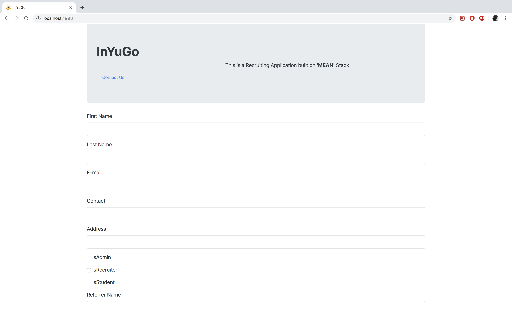

<b><i>INYUGO: MEAN-STACK WEBAPP</i></b>

TABLE OF CONTENTS\
	<pre> INTRODUCTION	</pre>
	<pre> SPECIFICATIONS	</pre>
	<pre> SOFTWARES REQUIRED	</pre>
	<pre> SOURCE CODE	</pre>
	<pre> INSTALLATION NOTES	</pre>
	<pre> ABOUT THE APPLICATION	</pre>

INTRODUCTION\
	This recruiting web application is built completely on MEAN stack. MongoDb for database, Express, Node for handling backend API calls and Angular 4 for the frontend User Interface. 
	Apart from the general service call handling and manipulation of the retrieved data, The Contact Us option has Voice recognition embedded into it. The User can speak his query and the respective response will be fetched and displayed to the user. The User can speak specific commands to activate or de-activate the voice recognition feature. 
<b>Check out this video to see Voice Recognition Feature in action.</b>

<pre><i>If the above video doesn't seem to work, you can find the same clip of Demo at (~/readme_images/voiceRecognitionDemo.mov) location.</i></pre>

SPECIFICATIONS\
	<pre>For a User to register himself, He has to provide the following information:</pre>
		<ul>
		<li> First name</li>
		<li> Last name</li>
		<li> E-mail</li>
		<li> Contact</li>
		<li> Address</li>
		<li> Username</li>
		<li> Password</li>
		<li> isRecruiter, isStudent, isAdmin Checkboxes</li>
		</ul>
	<pre>If ‘isAdmin’ option is selected, then it must be approved by another admin for access.(WIP)</pre>
	<pre>When a company wants to post a job offer, the following information should be provided:</pre>
	<ul>
	<li> Job Title: For example: “Software Developer”, “Full Stack Developer” etc</li>
	<li> Organization Name</li>
	<li> Type of Job: For example: “Full Time”, “Part Time”, etc.</li>
	<li> Salary (in CAD)</li>
	<li> Location</li>
	<li> Qualification</li>
	<li> Description</li>
	</ul>
	<pre>When an applicant applies for a posted job, the following information is requested:</pre>
		<ul>
		<li> Contact</li>
		<li> Email</li>
		<li> Address</li>
		<li> About Me: This is a brief description about the applicant</li>
		<li> Qualification</li>
	</ul>
	<pre>The web application should display the following information regarding the applicants that applied for each job offer:</pre>
			<ul>
				<li> Full name</li>
				<li> Qualification</li>
				<li> View Applicant Button to display the full information of the Applicant which includes all the fields filled by the applicant at the time of submitting the job application</li>
				<li> Reject Application Button to reject the submitted application</li>
			</ul>		
	<pre>The web application should facilitate to the recruiter, the following options for each Job opening regarding the applicants that applied for each job offer:</pre>
		<ul>
			<li> ‘Reject’ Button</li>
			<li> ‘Accept’ Button (WIP) </li>
		</ul>	
	<pre> The web application should facilitate to the applicant, the following options regarding the submitted job application for each job offer:</pre>
		<ul>
			<li> ‘Delete Applied Job’ Button to withdraw the submitted application</li>
		</ul>	
	<pre>The web application should facilitate to the user to speak a set of command in-order to search his concerns in the Contact Us page. He should also have the facility of typing his concerns and hit a Search button:</pre>
		<ul>
			<li> ‘Mic’ On/Off icon to toggle the voice recognition features active or in-active</li>
			<li> ‘Search’ Button (WIP) </li>
		</ul>
		
SOFTWARES REQUIRED\
	The software that are needed for the application to be edited or executed 
	<ul>
	<li> ‘backend’ --> Node JS.</li>
	<li> ‘API calls’ --> Express (not needed to install explicitly- gets auto installed while installing frontend) </li>
	<li> ‘frontend’ --> Angular (2/4/6), Bootstrap.</li>
	<li> 'database' --> Mongo Database.</li>
	<li> 'voice recognition' --> Annyang (not needed to install explicitly- gets auto installed while installing frontend).</li>
	</ul>

SOURCE CODE\
	The Source code for the application is in the ‘recruitingApp’ folder
	<ul>
	<li> ‘backend’ --> This folder has the source code for the API.</li>
	<li>‘frontend’ --> This folder has the source code for the Front User Interface.</li>
	</ul>

INSTALLATION NOTES\
	All the execution of this application will be done via command prompt terminal
<ol type="A">
	<li> Database </li>
	<ol type="i">
		<li> Navigate to the installed ‘bin’ directory of the MongoDb from your terminal and provide “./mongod” command for MAC or “mongo.exe” for Windows.</li>
	</ol>
	<li> ‘backend’ </li>
	<ol type="i">
		<li> Open a terminal and navigate to the ‘backend’ folder using the command:	<b>cd yourpath/meanStackApp/backend/</b></li>
		<li> Once inside the ‘backend’ folder, run the command: <b>npm install</b></li>
		<li> Then execute the command: <b>nodemon</b></li>
		<li> This will start the node files that possess the logic for the whole application to function</li>
		<li> The code listens on port 1990 by default</li>
	</ol>
<li> ‘frontend’ </li>
	<ol type="i">
		<li> Open another Terminal window and navigate into the ‘frontend’ folder using the command: <b>cd yourpath/meanStackApp/frontend/ </b></li>
		<li> Then type <b>npm install</b> to install all the necessary packages for the front end of the application </li>
		<li> Then type <b>npm start</b> or <b>yarn start</b> to start the front end of the application</li>
		<li> The User Interface runs on port 1993 by Default. </li>
	</ol>
	</ol>

ABOUT THE APPLICATION\
	This application can be accessed by visiting the url ‘http:localhost:1993/’ after you have installed and initiated the step given in the ‘INSTALLATION NOTES’ section.
The application data cannot be preloaded as it makes use of the logged in Session user information to store and retrieve information from the database. The application begins at the page displayed in screen shown in Figure 1. 

	

	Figure 1: Start-up screen of UI

The new user has to Register himself either by filling the fields requested. The Username and Password are then stored into the database. When a user attempts to log-in, this value is retrieved and are validated for access.
	
	

	Figure 2: Register Screen.

Once the user is Validated then he is redirected to either the Recruiter Dashboard or the Applicant Dashboard based on the information stored at Registration.
	If the user was registered as an Applicant then, the user sees a menu of open jobs on the screen where he is facilitated with two buttons (‘View full description’ and ‘ApplyFor the Job’) for all the available jobs(Figure 3). Upon selection of the ‘View full description’ button, the user is transferred to another screen which has the job-related information (Figure 4) where he has the ‘Apply For the Job’ button as well. Once the user clicks on the Apply button, he/she is transferred to a screen where the User can fill the details and click on ‘Apply’ button or choose to cancel (Figure 5).
	

	Figure 3: Applicant Dashboard

	

	Figure 4: Job-Info Screen

	

	Figure 5: Job-Apply Screen

<pre>Each Applicant can also click on the ‘View Applied Jobs’ button and check all the applications he has applied thus far and withdraw any application if he wishes to by clicking the ‘Delete Application’ button.(Figure 6)</pre>

	

	Figure 6: Check Applied Job Screen
	
If the user was registered as a Recruiter then, all the jobs created by that organization is displayed to him (Figure 7). Each job has two buttons namely Delete – to delete the job posting and Check all Applicants – to view the list of applicants who have applied for the job. 
The Recruiter can check out the list of all the applicants who have applied by clicking on the ‘Check All Applicants’ button where the user will be directed to a screen with the list and the recruiter can either choose to view full details of the applicant by clicking on the ‘View full details’ button (Figure 9) or reject the application by clicking the ‘Reject Applicant’ button (Figure 8). When the user click on the ‘Reject application’ button, an email is sent to the applicant and the status in the applicant’s ‘Check all applied Job’ screen changes. (WIP).

	Figure 7: Dash-Board of the Recruiter.
	
	

	Figure 8: View All Applicants Screen
	
	

	Figure 9: View full details Screen

The Contact Us Screen displays whether the browser in use supports Voice recognition or if the User has denied permission for his voice recognition. In either case, the user can type his concerns and the response will be displayed in the area below (Figure 10). 
If the browser supports voice recognition, then a series of simple commands is enlisted with regards to the use of the feature. The user can utter the queries and the appropriate response will be displayed in the section below (Figure 11). The user can also choose to stop using the feature by speaking another command or by simply clicking the button in which case, the icon changes and can be clicked again if the user wishes to use the feature yet again (Figure 12). Here as well the user can type and search for his queries.

	

	Figure 10: Un-supportive Browser or User has denied permission Screen

	

	Figure 11: Supportive Browser Screen

	

	Figure 11: User chooses to stop recording Screen

When the User hits the LOGOUT button, all the session information is cleared, and the user is redirected to the Main screen (Figure 1).
